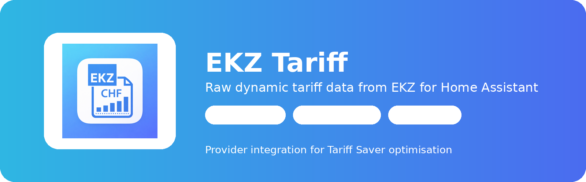

# EKZ Tariff

  

  
  
  
  

**EKZ Tariff** is a Home Assistant integration that provides **raw electricity tariff data from EKZ**.

The integration connects to the EKZ APIs and exposes tariff information as **verified raw data** inside Home Assistant.  
It is intentionally focused on **provider functionality only** and contains **no optimisation logic**.

---

## Features

- myEKZ dynamic tariffs (OAuth login)
- Public baseline tariffs
- 15-minute price slots (96 per day)
- Electricity price components
  - electricity
  - grid
  - regional fees
  - integrated
- Automatic daily tariff refresh
- Retry logic if EKZ publishes tariffs late
- Clean Home Assistant entities
- Designed as a **provider for other integrations**

---

## Architecture

  

EKZ Tariff is the **raw data provider layer**.  
Higher-level logic such as cost calculation, cheapest windows, charging optimisation, and historical analysis belongs in **Tariff Saver**.

---

## Tariff Saver

The raw tariff data from this integration is intended to be used by **Tariff Saver**.

Tariff Saver adds:

- cheapest charging windows
- tariff optimisation
- energy cost calculation
- EV charging optimisation
- battery optimisation
- historical tariff analysis

Repository:

**https://github.com/cnc-lasercraft/ha-tariff-saver**

---

## HACS Installation

1. Open **HACS**
2. Add this repository as **Custom Repository**
3. Category: **Integration**
4. Install **EKZ Tariff**
5. Restart Home Assistant

---

## Configuration

After installation:

`Settings → Devices & Services → Add Integration → EKZ Tariff`

Login with your **myEKZ account** to access your dynamic tariff.

---

## Entities

The integration exposes core tariff entities such as:

| Entity | Description |
|---|---|
| Electricity price | Energy price component |
| Grid price | Grid tariff |
| Regional fees | Local fees |
| Integrated price | Total price |
| Baseline price | Standard tariff reference |
| Current slot | Current 15-minute tariff slot |

The full 96-slot tariff curve is kept internally for optimisation engines.

---

## Diagnostics

The integration provides Home Assistant diagnostics including:

- API status
- tariff publication timestamps
- slot counts
- EMS link status

This helps troubleshooting API connectivity.

---

## Disclaimer

This project is **not affiliated with EKZ**.

It simply uses the public and myEKZ APIs to retrieve tariff information.
