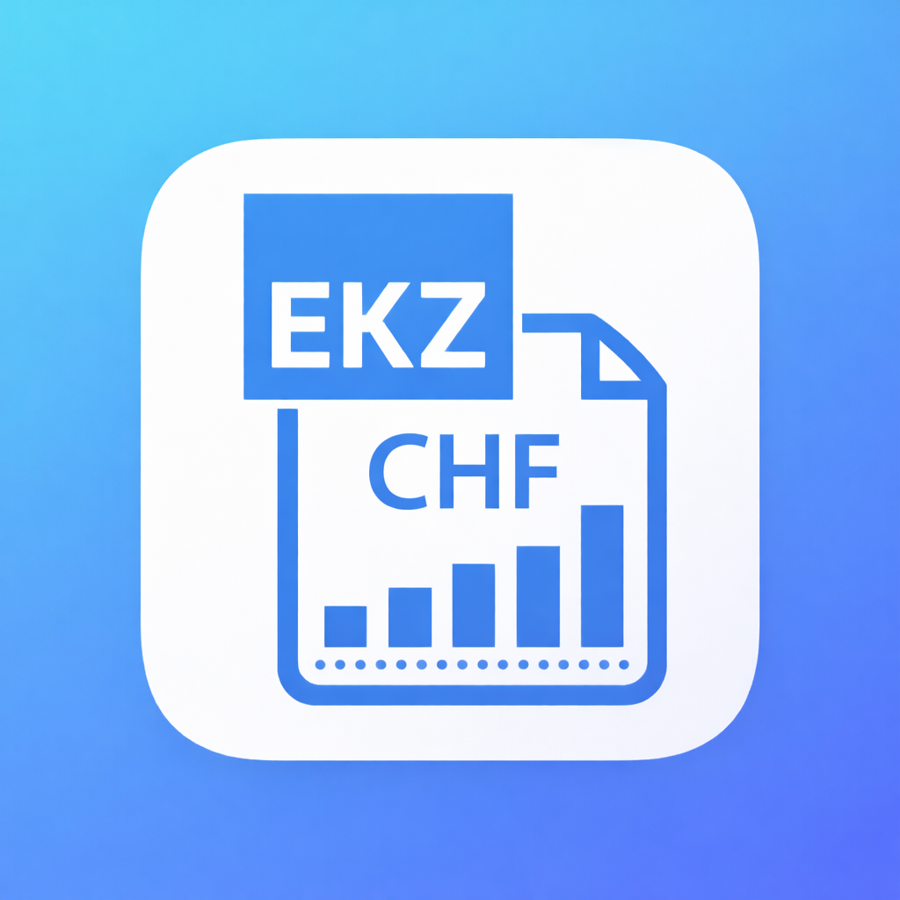

# EKZ Tariff

Home Assistant custom integration for **raw EKZ tariff data**.

## What it provides

- myEKZ OAuth2 login
- EMS link status + linking URL
- Personal tariffs from `/customerTariffs`
- Baseline tariff from public `/tariffs`
- Current price and all-in price
- Current component prices
- Compact curve sensors for active and baseline tariffs
- Publication timestamps
- Diagnostic sensors

## What it does not do

This integration intentionally does **not** calculate:

- costs
- baseline comparison logic
- savings
- cheapest windows
- charging optimization
- scoring

That logic belongs in **Tariff Saver**.

## Installation via HACS

1. Add this repository as a custom repository in HACS.
2. Install **EKZ Tariff**.
3. Restart Home Assistant.
4. Add the integration from **Settings → Devices & services**.

## Setup

During setup you provide:

- a name for the config entry
- the EKZ linking redirect URL
- the public baseline tariff name (default: `electricity_standard`)
- the daily publish time used for refresh scheduling
- OAuth login for myEKZ

## Notes

`EKZ Tariff` is the **raw data provider**.

`Tariff Saver` is intended to consume the provider data and add:

- cheapest windows
- scoring
- cost logic
- optimization
